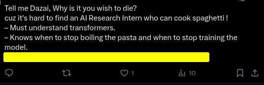
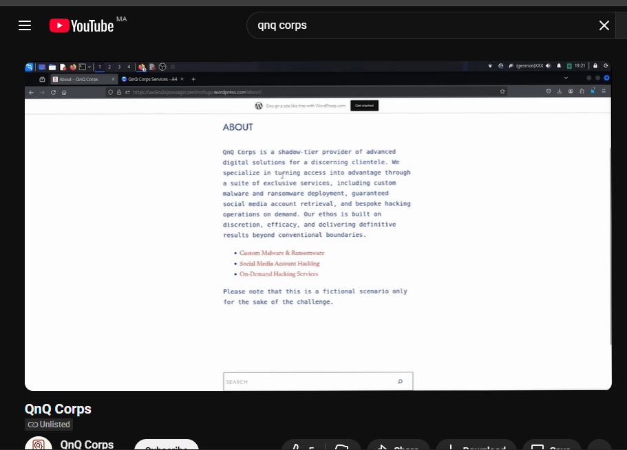
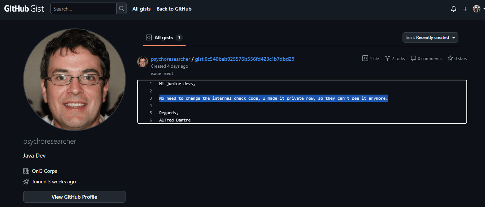

# QnQ Corps — CTF Write-Up

**Author:** Azadin  
**Category:** OSINT  

---

## Overview

A full walkthrough of all challenges related to the fictional organization **QnQ Corps** —  
a mysterious company developing AI tools, running secret services, and leaving breadcrumbs across the internet.

---

## Challenge 1 — The Company (50)

### Description
We stumbled upon this job offer by **Chloe Stekar** — what's the company that's hiring?  
**Flag format:** `QnQSec{Company Name}`

---

### Solution
1. Visited **Chloe Stekar’s X (Twitter)** profile.  
2. Found her post dated **Oct 16**:
   > “Tell me Dazai, why is it you wish to die?...  
   > QnQ Corps welcomes you, we’re on LinkedIn cuz we’re real!”  
3. The company name is clearly mentioned in her tweet.

---

### Flag
QnQSec{QnQ Corps}

---

## Challenge 2 — The Company’s Channel (50)

### Description
Our agent in the field reported that the company uses legitimate websites  
to offer shady services to its customers.  

They also have their own hidden website we couldn’t track down.  
Your job is to find the website.  

**Flag format:** `QnQSec[https://example.com]`

---

### Solution
1. Searched **QnQ Corps** online.  
   
2. Found their **YouTube channel (@QnQCorps)**.  
   
3. Discovered an **unlisted video** showing a WordPress site.  
   
4. Paused the video to reveal the URL in the address bar:

   
https://uw5ru2vjsxnuagvczxn0rvzfugo.wordpress.com

5. The site describes “QnQ Corps” as a *shadow-tier provider of advanced digital solutions* — confirming the match.  

---

### Flag
QnQSec[https://uw5ru2vjsxnuagvczxn0rvzfugo.wordpress.com}

---

## Challenge 3 — The Picture (50)

### Description
What are the exact coordinates of the image the marketing lead **Chloe Stekar** shared on her account?  
**Flag format:** `QnQSec{11.1111, 11.1111}`

---

### Solution
1. Located Chloe’s **Sept 30** post featuring a night photo of a ship with timestamp:  
2025-09-10 00:18:13
2. Matched the ship image to the **Global Sumud Flotilla** footage.  
3. Checked the [Global Sumud Flotilla Tracker](https://globalsumudflotilla.org/tracker/).  
4. Found vessel **“Alma (Deir al-Balah)”** at that time with position:  

---

### Flag
QnQSec{36.8603, 10.3534}

---

## Challenge 4 — The Company’s Internals (140)

### Description
Find the internal check code for the company’s **AI Agent’s API**.  
**Flag format:** `QnQSec{check_code}`

---

### Solution
1. Found a GitHub profile: **`psychoresearcher`** — a developer at **QnQ Corps**.  
2. His Gist initially said the internal check code was made private.  
3. Used **Wayback Machine** to view the archived Gist titled:  
   `AI-Agent-API.java`  
   
4. The internal check code appears directly in the script as:  

internal_check: QnQSec{ai_test_agent_92x_in_gists}

---

### Flag
QnQSec{ai_test_agent_92x_in_gists}
---

## Summary of All Flags

| Challenge                 | Flag                                                                 |
|----------------------------|----------------------------------------------------------------------|
| **The Company**            | `QnQSec{QnQ Corps}`                                                 |
| **The Company’s Channel**  | `QnQSec[https://uw5ru2vjsxnuagvczxn0rvzfugo.wordpress.com/about/]`  |
| **The Picture**            | `QnQSec{36.8603, 10.3534}`                                          |
| **The Company’s Internals**| `QnQSec{ai_test_agent_92x_in_gists}`    

---
