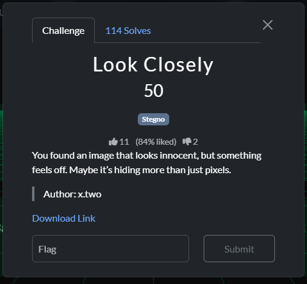
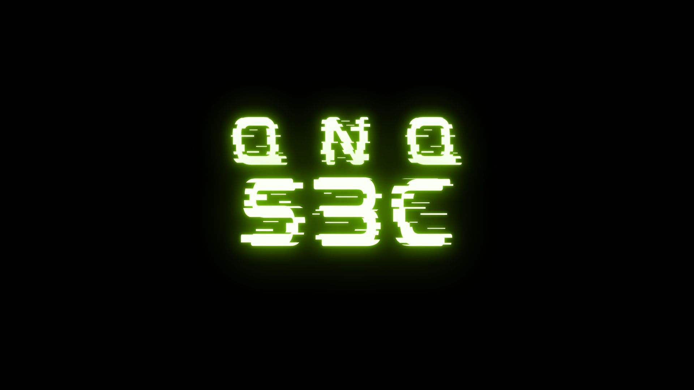
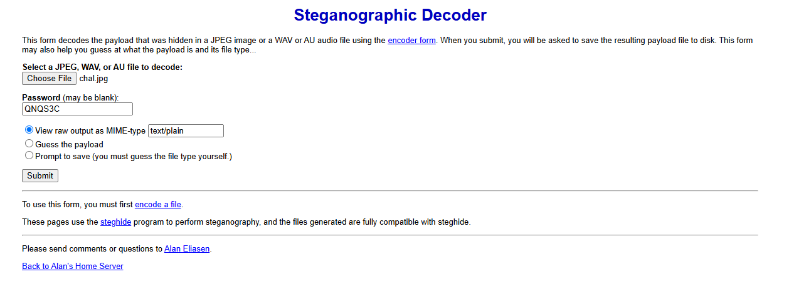

# Look Closely — Writeup




**Category:** Steganography\
**Points:** 50\
**Author:** x.two

---

## Challenge Description

> You found an image that looks innocent, but something feels off.\
> Maybe it’s hiding more than just pixels.

---

## &#x20;My Approach

When I opened the image, it looked like a simple glowing green text saying:

```
QNQS3C
```



That immediately caught my attention — it could be a **password** or **encoded key**.


---

## &#x20;Step 1: Analyze the Image

Since this is a **Stego** challenge, I suspected there might be hidden data *inside* the image file itself.

I tried checking file info and metadata with:

```bash
exiftool chal.jpg
```

but nothing interesting appeared.

---

## Step 2: Use an Online Steganography Decoder

I used the online tool [FutureBoy Steganography Decoder](https://futureboy.us/stegano/decinput.html).

1. Uploaded the challenge image.
2. In the **Password** box, entered the text shown in the image:
   ```
   QNQS3C
   ```

   
3. Clicked **Decode**.

---

## Step 3: Retrieve the Hidden Flag

The tool successfully extracted hidden data and revealed the flag inside the image.

---

## **Flag**

```
QnQSec{stegno_1s_fun}
```


---

## Notes

This challenge was a great example of **password-protected image steganography**.\
The clue (**Look Closely**) hinted that the password was hidden in plain sight — right inside the image itself.

---


