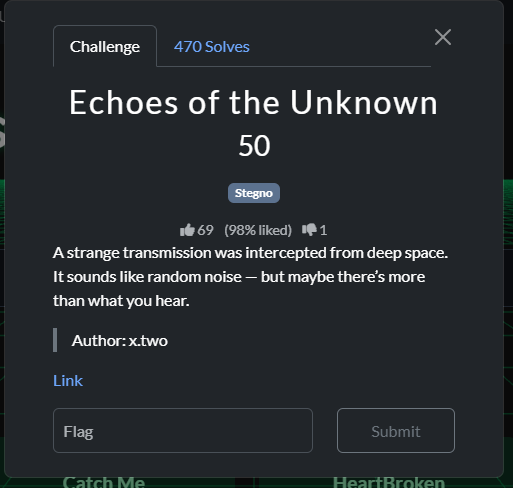

**Challenge Description:**

When I listened to the file, it just sounded like static noise.
Because it was in the Steganography category, I suspected there might be hidden information in the audio spectrum — something that can be visualized using Sonic Visualizer.

**Approach:**

At first glance, the challenge file sounded like static noise. Since it was in the Steganography category and mentioned “random noise”, I suspected there might be hidden data inside the audio — possibly encoded visually in the spectrogram.

**Tools Used:**

Sonic Visualizer — to visualize the frequency spectrum

